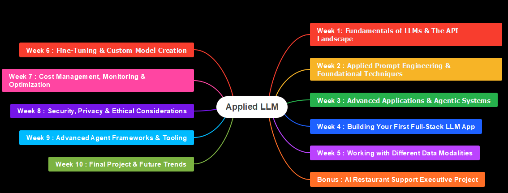

# 10 Week Applied LLM course for beginners
Welcome to "Applied LLM"! I'm thrilled to have you here. Over the next 10 weeks, we're going on a journey to not just learn about Large Language Models, but to master the art of building practical, real-world applications with them. 

We'll start with the absolute basics—what an LLM even is—and quickly move into the hands-on, project-based work that will define this course. Forget dense theory and abstract concepts; our focus is on building, experimenting, and solving problems. 

## You can watch associated video below 

My goal is to equip you with the skills to confidently develop, evaluate, and deploy your own LLM applications, turning you from a beginner into a skilled practitioner. 

Let's get started.

## Note: This course needs basic uderstanding of Python.
If you are new to Python, please visit my Python fundamentals course before starting this LLM course
- [Python Fundamentals](https://github.com/simplifylearning101/dsa_with_python/tree/main/Week0%20Python%20Fundamentals)
- Optional [Python Advanced](https://github.com/simplifylearning101/dsa_with_python/tree/main/Week1%20Advanced%20Python)

### **Applied LLM Course Roadmap**

**Course Philosophy:**

* **Applied, not Theoretical:** The focus is on practical application. Theory is provided to understand the "why," but the majority of time is spent on the "how."
* **Simple is Key:** Complex concepts are broken down into simple, digestible pieces. Jargon is avoided unless it is clearly explained.
* **Practice, Practice, Practice:** Learning is an active process. The course includes hands-on exercises, coding challenges, and a final project to solidify understanding.
* **From Zero to Hero:** The curriculum starts with the absolute basics and progressively builds to advanced topics. No prior knowledge of LLMs is assumed.

---

### **10-Week Roadmap** 🗺️

#### **Week 1: Fundamentals of LLMs & The API Landscape**
* **Concepts:** What are Gen AI and LLMs? How do they work at a high level?
* **API Basics:** Interacting with LLMs via API calls.
* **Setup:** Setting up your environment and API keys.
* **Link:** [Week1](week1/README.md)

#### **Week 2: Applied Prompt Engineering & Foundational Techniques**
* **Core Concepts:** Programmatic prompting, dynamic context, and few-shot learning.
* **Structured Data:** Extracting and validating structured data (e.g., JSON) from unstructured text.
* **Text Manipulation:** Summarization, transformation, and stylistic changes in code.
* **Chatbots:** Building multi-turn conversational agents with context management.
* **Robustness:** Handling errors, implementing retries, and managing I/O with files and the web.
* **Link:** [Week2](week2/README.md)

#### **Week 3: Advanced Applications & Agentic Systems**
* **Chaining:** Orchestrating multiple LLM calls for complex tasks.
* **Agents:** The core principles of agentic LLMs.
* **Tool-Use:** Enabling LLMs to use external tools like search engines, databases, and custom functions.
* **Retrieval-Augmented Generation (RAG):** Connecting LLMs to a private knowledge base to combat hallucinations and provide up-to-date information.
* **Link:** [Week3](week3/README.md)

#### **Week 4: Building Your First Full-Stack LLM App**
* **Project Kickoff:** Planning a complete, end-to-end application.
* **Backend:** Setting up a simple web server (e.g., Flask or FastAPI) to serve your LLM logic.
* **Frontend:** Building a basic user interface (HTML/CSS/JS) to interact with your backend.
* **Deployment:** Getting your application live on a cloud platform (e.g., GCP, AWS or Azure).
* **Link:** [Week4](week4/README.md)

#### **Week 5: Working with Different Data Modalities**
* **Vision Models:** Integrating and interacting with multimodal LLMs that can process images.
* **Audio:** Using speech-to-text (STT) and text-to-speech (TTS) APIs to build voice-enabled applications.
* **Project:** Building a simple multimodal application (e.g., an app that describes an uploaded image).
* **Link:** [Week5](week5/README.md)

#### **BONUS: AI Restaurant Support Executive Project**
* **Link:** [Week5_Bonus](week5_Bonus/README.md)

#### **Week 6: Fine-Tuning & Custom Model Creation**
* **Concepts:** When and why to fine-tune an LLM.
* **Data Preparation:** The process of creating high-quality training data.
* **Fine-Tuning:** Executing a fine-tuning job on a small model (e.g., using OpenAI, Hugging Face).
* **Deployment:** Using your custom-tuned model in an application.

#### **Week 7: Cost Management, Monitoring & Optimization**
* **Cost Control:** Strategies for managing API costs and token usage.
* **Latency:** Techniques for reducing latency and improving response times.
* **Monitoring:** Logging, tracing, and monitoring LLM application performance.
* **Evaluation:** Developing metrics to evaluate the quality of your LLM outputs.

#### **Week 8: Security, Privacy & Ethical Considerations**
* **Security:** Prompt injection attacks and how to mitigate them.
* **Privacy:** Handling sensitive user data responsibly.
* **Ethics:** Bias, fairness, and transparency in LLM applications.
* **Responsible Development:** Best practices for building ethical and safe systems.

#### **Week 9: Advanced Agent Frameworks & Tooling**
* **Frameworks:** An introduction to popular agent frameworks (e.g., LangChain, LlamaIndex).
* **Tooling:** Using and creating more complex tools for agents (e.g., integrating with a database, external APIs).
* **Project:** Building a more complex, multi-step agent using a framework.

#### **Week 10: Final Project & Future Trends**
* **Project:** Develop a comprehensive, full-stack LLM application combining the skills from the entire course.
* **Showcase:** Present your final project.
* **Trends:** Discuss the future of LLMs, new architectures, and what's on the horizon.
