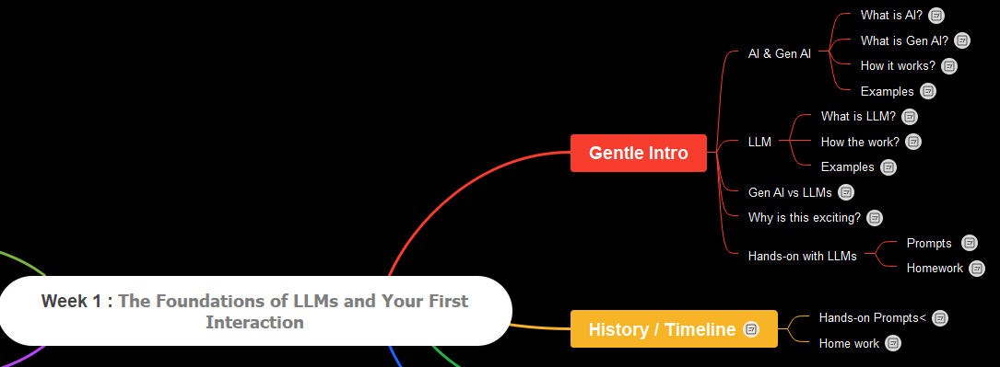

### **Week 1: Hour 1 - The "Hello, World\!" of LLMs**

### In the class & on YT video, we will discuss below. 


## What is an LLM? (The Simple Explanation)
- An LLM is a highly sophisticated **"text predictor"**. just like the predictive text on your phone, but on a massive scale. 
- It has been trained on a colossal amount of data from the internet - books, articles, code, conversations - to learn the statistical patterns of language. 
- Its primary job is to guess the next most likely word in a sequence. 
- When you give it a prompt, it's essentially completing your sentence, but the "sentence" can be a story, an email, or a response to a question. 
- The immense size of its training data allows it to generate coherent, contextually relevant, and often creative responses.
- Analogy: Imagine a student who has read every book in the world's largest library. They don't **know** things in the human sense, but they are so familiar with the patterns of language that they can accurately guess how any given sentence or paragraph should continue. This is the essence of an LLM.

### Hands-on Session: Your First Conversation
**Objective:** To get hands-on with a public LLM and observe its behavior firsthand. We will not use any code yet.

**Task 1: The "Hello, World\!" Prompt :**

- try the below prompt:
  ```
  Explain what a Large Language Model is in a simple way, using an analogy.
  ```
- Read the response carefully. Does the analogy make sense? 

**Task 2: Testing Creativity:**
- In the same conversation, or a new one, try:
  ```
  Write a very short, 3-sentence story about a friendly robot named Sparky who loves to bake cookies.
  ```
- Does the story have a beginning, middle, and end, even in just three sentences? 
- Notice how the model generates a narrative that fits the request. It's not just retrieving a pre-written story; it's generating a brand new one based on the patterns it learned.

**Task 3: The Role-Playing Prompt:**
- Let's see if the LLM can adopt a persona. Try the following:
  ```
  You are a wise old owl from a magical forest. Give me a piece of advice about patience.
  ```
- Pay attention to the tone and word choice. 
- Does the LLM use words or phrases you'd associate with a wise old owl? 
- This demonstrates its ability to understand and adopt a specific **persona** or **role**.

**Task 4: A Challenge to the System:**

- Now, let's try something it might not know. Type this vague or nonsensical question:
  ```
  What is the square root of a butterfly?
  ```
- What is the response? Does it try to give a number, or does it explain why the question doesn't make sense? 
- This is a crucial lesson: LLMs can't reason like humans (they are improving a lot), and they often default to explaining the logical fallacy of a prompt.

**Conclusion of Hands-on Session:**
By completing these tasks, you have successfully engaged with an LLM on multiple levels: for simple explanation, for creative generation, for role-playing, and for understanding its limitations. 